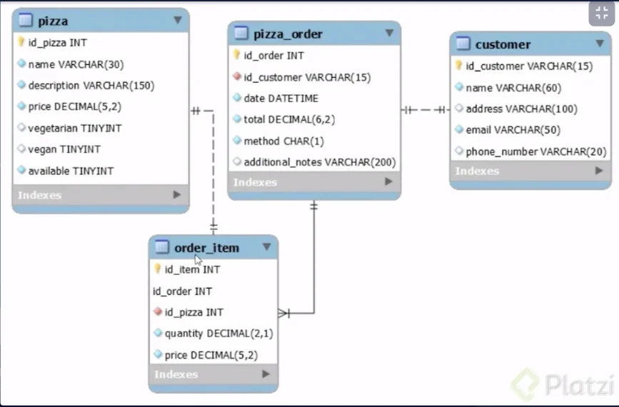

# Platzi-pizzeria project
Pizzeria - Platzi (Curso de Java Spring Data JPA)
Course: https://platzi.com/cursos/java-spring-data/
My Notes: https://www.notion.so/notaswebs/JPA-Pizza-example-c567bfeb1148453f8e30dca840968734?pvs=4



## Pasos para iniciar el proyecto

1. Asegurese que el servidor de MySQL este corriendo en el puerto 3306
2. No cree ninguna base de datos, el proyecto se encargara de crearla
3. Ejecute el proyecto con el comando `mvn spring-boot:run`
4. Asegurese se esté ejecutando en el puerto 8080


## Estructura de pizzas


```json
{
    "idPizza": 13,
    "name": "Margherita3",
    "description": "Fior de Latte, Homemade Tomato Sauce, Extra Virgin Olive Oil & Basil.",
    "price": 22.5,
    "vegetarian": true,
    "vegan": false,
    "available": true
}
```

Pizzas:

```json
[
    {
        "idPizza": 1,
        "name": "Pepperoni",
        "description": "Pepperoni, Homemade Tomato Sauce & Mozzarella.",
        "price": 23.0,
        "vegetarian": false,
        "vegan": false,
        "available": true
    },
    {
        "idPizza": 2,
        "name": "Margherita",
        "description": "Fior de Latte, Homemade Tomato Sauce, Extra Virgin Olive Oil & Basil.",
        "price": 18.5,
        "vegetarian": true,
        "vegan": false,
        "available": true
    },...
```